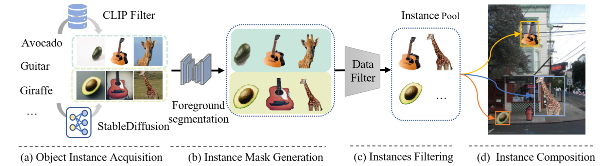

# X-Paste, ICML 2023

The repo is the official implementation of ["X-Paste: Revisiting Scalable Copy-Paste for Instance Segmentation using CLIP and StableDiffusion"](https://arxiv.org/abs/2212.03863).

## Introduction


  X-Paste is built upon Copy-Paste to train the instance segmentation model but aims to make Copy-Paste more scalable, i.e., obtain large-scale object instances with high-quality masks for unlimited categories in an efficient and automatic way. 

## Requirements

```
pip install -r requirements.txt
```

Download [COCO](https://cocodataset.org/#download) and  [LVIS](https://www.lvisdataset.org/dataset) dataset, place them under $DETECTRON2_DATASETS following [Detectron2](https://github.com/facebookresearch/detectron2/tree/main/datasets)


Download pretrained backbone 
```
mkdir models
cd models
wget https://miil-public-eu.oss-eu-central-1.aliyuncs.com/model-zoo/ImageNet_21K_P/models/resnet50_miil_21k.pth
python tools/convert-thirdparty-pretrained-model-to-d2.py --path resnet50_miil_21k.pth

wget https://github.com/SwinTransformer/storage/releases/download/v1.0.0/swin_base_patch4_window7_224_22k.pth
python tools/convert-thirdparty-pretrained-model-to-d2.py --path swin_base_patch4_window7_224_22k.pth
```

## Getting Started 
1. generate images with stablediffusion: generation/text2im.py

```
cd generation
pip install -U diffusers transformers xformers
python text2im.py --model diffusers --samples 100 --category_file /mnt/data/LVIS/lvis_v1_train.json --output_dir /mnt/data/LVIS_gen_FG
```

2. Segment foreground object segment_methods/reseg.py 

```
cd segment_methods

## for each segment method, you should manually download their models and edit the model path in export.py 

python reseg.py --input_dir /mnt/data/LVIS_gen_FG --output_dir /mnt/data/LVIS_gen_FG_segs/ --seg_method clipseg
python reseg.py --input_dir /mnt/data/LVIS_gen_FG --output_dir /mnt/data/LVIS_gen_FG_segs/ --seg_method UFO
python reseg.py --input_dir /mnt/data/LVIS_gen_FG --output_dir /mnt/data/LVIS_gen_FG_segs/ --seg_method U2Net
python reseg.py --input_dir /mnt/data/LVIS_gen_FG --output_dir /mnt/data/LVIS_gen_FG_segs/ --seg_method selfreformer
```

3. Filtering object and create object pool 

```
cd segment_methods

python clean_pool.py --input_dir /mnt/data/LVIS_gen_FG_segs/ --image_dir /mnt/data/LVIS_gen_FG --output_file /mnt/data/LVIS_instance_pools.json --min_clip 21 --min_area 0.05 --max_area 0.95 --tolerance 1

```

4. train network 

```
## edit INST_POOL_PATH in config file as your instance pool json
bash launch.sh --config-file configs/Xpaste_swinL.yaml

```

5. demo
```
python demo.py --config-file configs/Xpaste_swinL.yaml --input example.jpg --output annotated.jpg --opts MODEL.WEIGHTS Xpaste_swinL_final.pth
```

Qualitative results of X-Paste and baseline on LVIS test set. Left: X-Paste,
Right: baseline (Swin-L)

## Models (LVIS dataset)
| Backbone  | method | $AP^{box}$ | $AP^{mask}$ | $AP_r^{box}$ | $AP_r^{mask}$ | checkpoint |
|:--------:|:----------:|:----------:|:-----------:|:------------:|:-------------:|:-------------:|
| ResNet50  | baseline |    34.5    |     30.8    |     24.0     |      21.6    | [model](https://drive.google.com/drive/folders/1vVwrZ4ad0xiWVO-JLaxRdLMDq4vdRZwT?usp=sharing) |
| ResNet50  | X-Paste  |    37.4    |     33.2    |     33.9     |      29.7     | [model](https://drive.google.com/drive/folders/1vVwrZ4ad0xiWVO-JLaxRdLMDq4vdRZwT?usp=sharing) |
|  Swin-L  | baseline |    47.5    |     42.3    |     41.4    |      36.8     | [model](https://drive.google.com/drive/folders/1vVwrZ4ad0xiWVO-JLaxRdLMDq4vdRZwT?usp=sharing) |
|  Swin-L  | X-Paste  |    50.9    |     45.4    |     48.7     |      43.8    | [model](https://drive.google.com/drive/folders/1vVwrZ4ad0xiWVO-JLaxRdLMDq4vdRZwT?usp=sharing) |

## Acknowledgements

We use code from [Detic](https://github.com/facebookresearch/Detic), [CenterNet2](https://github.com/xingyizhou/CenterNet2) and [Detectron2](https://github.com/facebookresearch/detectron2)

## Lisence 

The majority of our X-Paste is licensed under the Apache 2.0 license, portions of the project are available under separate license terms: SWIN-Transformer, CLIP, CLIPSeg, UFO and TensorFlow Object Detection API are licensed under the MIT license; UniDet, U2Net and Detic are licensed under the Apache 2.0 license; Selfreformer is lisenced under BSD 3-Clause License; Stable Diffusion is lisenced under CreativeML Open RAIL M License and the LVIS API is licensed under a custom license. If you later add other third party code, please keep this license info updated, and please let us know if that component is licensed under something other than CC-BY-NC, MIT, or CC0

## Citation

X-Paste: Revisiting Scalable Copy-Paste for Instance Segmentation using CLIP and StableDiffusion

```
@inproceedings{Zhao2022XPasteRC,
  title={X-Paste: Revisiting Scalable Copy-Paste for Instance Segmentation using CLIP and StableDiffusion},
  author={Hanqing Zhao and Dianmo Sheng and Jianmin Bao and Dongdong Chen and Dong Chen and Fang Wen and Lu Yuan and Ce Liu and Wenbo Zhou and Qi Chu and Weiming Zhang and Nenghai Yu},
  booktitle={International Conference on Machine Learning},
  year={2023}
}
```
